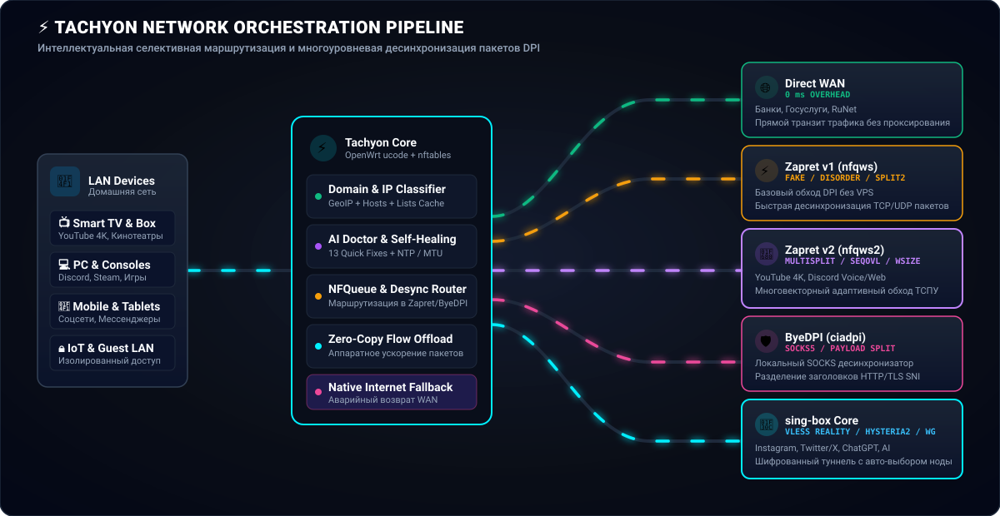
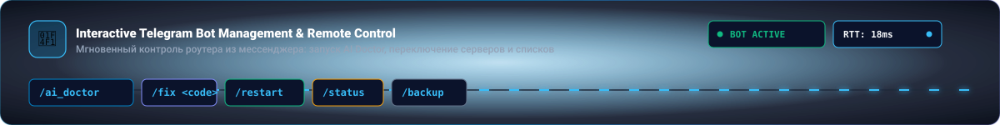
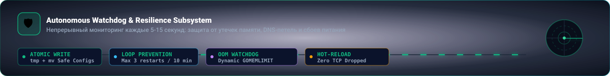
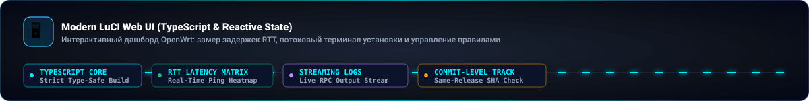
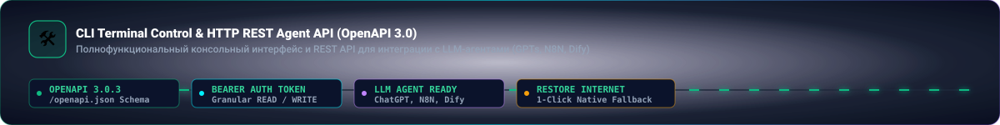

<div align="center">



[](https://github.com/Dushnilin/tachyon/stargazers)
[](https://github.com/Dushnilin/tachyon/releases)
[](https://openwrt.org/)
[](https://t.me/tachyon_proxy)
[](LICENSE)

[**🇷🇺 Русский**](README.md) | [**🇬🇧 English**](README.en.md)

</div>

<p align="center">
  
</p>

## ⚡ About Tachyon

**Tachyon** is an advanced, autonomous network routing, proxy orchestration, and anti-censorship engine designed specifically for **OpenWrt** routers (fully supporting **OpenWrt 23.05, 24.10, 25.x, and SNAPSHOT** builds). Direct fork of **[Forkop by @ushan0v](https://github.com/ushan0v/forkop)** (formerly **Podkop Plus**).

Tachyon combines the power of **sing-box**, local hardware DPI bypass engines (**Zapret v1 / Zapret v2 / ByeDPI**), an interactive combinatorial **DPI Strategy Fuzzer**, a hardened **Telegram control bot**, and a cutting-edge **AI Stack** (autonomous **AI Doctor v2.5**, offline local diagnostics, **HTTP REST Agent API / OpenAPI 3.0**, and **Model Context Protocol (MCP)** server for autonomous AI agents).

The entire backend logic is written in **ucode** — OpenWrt's native, high-performance C scripting language — delivering instant response times with minimal RAM footprint (starting from 128 MB RAM devices).

<p align="center">
  
</p>

## 🌐 Architecture & Traffic Pipeline

<div align="center">



</div>

Tachyon intercepts network flows via kernel **nftables** and dispatches requests without unnecessary latency:
1. **Direct WAN**: Local services, national banks, and trusted destinations proceed without proxy overhead (`0 ms overhead`).
2. **Zapret v1 (`nfqws`)**: Basic TCP/UDP packet desynchronization (`fake`, `disorder`, `split2`) directly on router without VPS.
3. **Zapret v2 (`nfqws2`)**: Advanced multi-vector DPI evasion (`multisplit`, `seqovl`, `wsize`, PAWS `tcp_ts`, authentic `blobs`) for YouTube 4K, Discord, and streaming.
4. **ByeDPI (`ciadpi`)**: Local SOCKS5 desync engine with HTTP/TLS SNI payload fragmentation.
5. **Encrypted Proxy Tunnel (sing-box)**: Censored endpoints and private traffic are routed through modern protocols (VLESS Reality, Hysteria2, WireGuard, AmneziaWG).
6. **Smart DNS Pipeline**: Isolated DNS processing via FakeIP (`198.18.0.0/15`), DoH/DoT/DoQ with anti-hijack transparent redirection and automated failover (DNS Failover).

<p align="center">
  
</p>

## 🔥 Core Features & Subsystems

### 🛡️ 1. Multi-Protocol Proxying & Smart DNS Stack
* **sing-box Engine (v1.11+)**: Native support for modern proxy protocols — **VLESS (Reality / gRPC / WS)**, **VMess**, **Shadowsocks**, **Trojan**, **Hysteria2**, and **WireGuard / AmneziaWG**.
* **Cloudflare WARP & AmneziaWG Generator (`generate_warp`)**: Instant generation of working WireGuard and AmneziaWG profiles directly on the router.
* **Multi-Dimensional Selective Routing**: 
  * **By Domains & IP Subnets**: Route only target traffic through proxies or desync engines.
  * **By Client Devices (MAC / IP)**: Per-device routing rules for Smart TVs, smartphones, PCs, and gaming consoles.
  * **By GeoIP & Countries**: Flexible inclusion/exclusion list controls based on destination country.
* **Automated Subscription Updates**: Background fetching, parsing, and node rotation from remote subscription URLs with automated latency (RTT) testing and server groups (URL-Test, Failover).
* **🌐 Smart DNS & Failover Pipeline**:
  * **FakeIP Pool (`198.18.0.0/15`)**: Near-instant connection establishment without waiting for remote DNS responses.
  * **Modern DNS Protocol Support**: DoH (DNS over HTTPS), DoT (DNS over TLS), DoQ (DNS over QUIC), and DNS over HTTP/3.
  * **Autonomous DNS Failover Daemon (`dns_failover.uc`)**: Continuous upstream health probing with seamless automatic fallback to secondary resolvers upon failure.
  * **Anti-DNS Hijack**: Transparent kernel-level interception of UDP/TCP port 53 via nftables, preventing ISP spoofing.
  * **Interactive DNS Benchmark (`tachyon dns_benchmark`)**: Measure response times and censorship resistance of popular public resolvers with auto-tuning (`dns_autotune`).
* **🌐 Hosts Sections & DNS Overrides (Hosts Engine)**:
  * **Static DNS Overriding (`dns_hosts`)**: Direct mapping of domains to static IP addresses in sing-box DNS and dnsmasq without modifying `/etc/hosts`.
  * **Remote Hosts Lists Ingestion (`hosts_list_urls`)**: Automatic background downloading and parsing of external host lists and blocklists (AdAway, StevenBlack, custom blocklists).
  * **Unified Cache (`combined.txt`)**: High-performance deduplication, merging, and global caching of multiple remote host sources into a single lightweight cache.
  * **GitHub Mirror Failover**: Resilient downloads that automatically retry via mirrors (`cdn.jsdelivr.net`, `gh-proxy.com`, `ghproxy.net`) if direct access to github.com is blocked or throttled.

<p align="center">
  
</p>

### 🚀 2. God-Tier DPI Bypass Strategy Generator & Fuzzer (DPI Fuzzer Engine)
* **Autonomous Combinatorial Fuzzing**: Built-in intelligent benchmarking engine accessible via LuCI Web UI and CLI (`tachyon fuzzer_start`), testing and optimizing desync strategies for **Zapret2 (`nfqws2`)**, **Zapret v1 (`nfqws`)**, and **ByeDPI (`ciadpi`)**.
* **PAWS TCP Timestamp Spoofing (`tcp_ts=-600000:tcp_ts_up`)**:
  Innovative DPI desync technique utilizing stale TCP timestamps. Fake ClientHello packets are sent with timestamps shifted 10 minutes into the past: the destination web server silently drops them under RFC 7323 PAWS, while the middlebox/DPI desynchronizes and allows legitimate traffic through.
* **Authentic Binary Dumps (Blobs)**:
  Native support for realistic ClientHello, QUIC, and STUN payloads (`tls_max`, `tls_google`, `tls_gosuslugi`, `tls_sber`, `tls_iana`, `tls_vk`, `quic_google`, `stun_fake`, `discord_udp`). The fuzzer automatically discovers payloads on the router and injects arguments into the daemon.
* **Exact Sequence Overlap (SeqOvl Pattern Overlap)**:
  Byte-accurate sequence overlapping strategies (`seqovl=664:seqovl_pattern=tls_max`, `seqovl=681:seqovl_pattern=tls_google`) that glue allowed SNIs over target SNIs inside the DPI reassembly window.
* **TCP SYN Data Injection (`--lua-desync=syndata`) & Compressed Lua Scripts**:
  Payload injection directly inside the TCP SYN handshake paired with `multidisorder` and `multisplit`, alongside automated decompression of `.lua.gz` scripts.
* **Massive Library of Validated Strategies**:
  * **286+ combinatorial Zapret2 strategies** (YouTube 4K Kyber, GoogleVideo CDN streams, Discord Full-Stack voice + RTC UDP, Fakedsplit, Fakeddisorder, Hostfakesplit, and Low-TTL 3–8 matrix with `badseq`, `md5sig`, `badack`, `datanoack`).
  * 130 strategies for Zapret v1 and 65 for ByeDPI.
* **Pre-configured Target Suites**: Ready-to-use benchmark suites for `youtube_suite`, `discord_suite`, `twitch_suite` (HLS Usher), `twitter_suite`, and `chatgpt_suite`.
* **Isolated Netfilter Queue (`0x00200000`)**: Test traffic is isolated into a dedicated Netfilter queue without interfering with standard home LAN routing or TProxy.
* **1-Click Strategy Application (`🏆 Best Match`)**: Instantly commit the winning strategy directly into UCI configuration with a single click.

<p align="center">
  
</p>

### 🤖 3. AI Doctor, REST Agent API & MCP Server (AI Stack v2.5)

<div align="center">


</div>

* **Tachyon AI Doctor (v2.5)**: Deep AI diagnostic engine supporting modern LLMs (**OpenAI**, **Anthropic Claude**, **DeepSeek**, or local models via OpenRouter / Ollama).
  * **Deep Contextual Intelligence**: Feeds real-time service health, Watchdog failure history (OOM events, error streaks), and compressed system logs into the LLM prompt.
  * **Multi-Fix Execution Chains**: Generates multi-action repair sequences with dedicated UI buttons per fix or a single "Fix All" action.
* **🩺 Offline Local Rule Doctor**:
  * **13 Built-in Quick Fix Codes**: Automated repairs for sing-box, nftables, dnsmasq, resolv.conf, DNS cache clearing, subscription refreshing, and network stack restarts.
  * **NTP Time Synchronization (`fix_system_time`)**: Automatic detection and recovery from system clock desync.
  * **Conntrack Table Flush (`flush_conntrack`)**: Clears connection tracking tables during network storms.
  * **DNS Dead-lock Repair (`fix_bootstrap_dns`)**: Prevents circular deadlock on sing-box primary bootstrap resolvers.
  * **Tunnel MTU Optimization (`optimize_mtu`)**: Automatic MTU tuning for WireGuard / AmneziaWG tunnels.
* **🚨 Emergency Native Internet Fallback**:
  * Instant 1-click restore of clean WAN internet via UI or `tachyon restore_native_internet` CLI command without rebooting the router.
* **🔌 Model Context Protocol (MCP) Server**:
  * Built-in MCP standard implementation (`tachyon mcp`) over JSON-RPC 2.0 stdio: connect your router directly to Claude Desktop, Cursor, Antigravity, and autonomous AI agents as an executable network tool.
* **🌐 HTTP REST Agent API (OpenAPI 3.0)**:
  * Full programmatic REST API (`/cgi-bin/tachyon-agent/`) for external monitoring, rule management, and orchestration.

<p align="center">
  
</p>

### 📱 4. Interactive Telegram Control Bot

<div align="center">



</div>

A resilient, feature-rich control center right inside your messenger:
* **Live Rule Management**: View active routing lists and instantly add new domains or IP subnets on the fly.
* **Interactive Section Editor**: Enable, disable, and configure routing rules with inline keyboard actions.
* **Server Selection & Latency**: Switch active proxy nodes with live RTT ping measurements and 64-byte payload limit protection (`cb_data`).
* **Real-time Connection Monitor (`/connections`)**: Inspect active client connections with paginated views and an emergency session termination button (`/close_connections`).
* **Quiet Hours (`/qh`)**: Configure alert mute windows to suppress notifications during nighttime hours.
* **Device Access Control**: View active DHCP clients and block/unblock internet access by MAC address.
* **Resilient Dual Transport**: Automatic fallback to direct WAN if proxy route stalls, segregated curl timeouts (12s commands / 35s polling), and HTML tag auto-closing.
* **Diagnostics & Commands**: `/doctor`, `/ai_doctor`, `/heal`, `/speed`, `/ping`, `/test`, `/logs`, `/info`, `/export_config`, `/restart`, `/lang`.

<p align="center">
  
</p>

### 🛡️ 5. Watchdog — Protection, Self-Healing & Snapshots

<div align="center">



</div>

Watchdog is the heart of Tachyon's stability, running every 5–15 seconds without external dependencies:
* **Atomic Operations & UCI Backups**: Configuration writes via `tmp` + `mv` prevent file corruption during sudden power losses.
* **Restart-Loop Protection**: Maximum 3 restarts per 10 minutes (`safe_proxy_restart()`), `PROXY_RESTART_LOCK` mutex, and DNS query loop cooldowns.
* **Memory Optimization (OOM Watchdog)**: Dynamic `GOMEMLIMIT` adjustment under memory pressure with automated Telegram alerts.
* **Seamless Hot-Reload**: Rule updates and server switches apply softly without dropping active TCP connections (Discord calls, gaming, and downloads remain uninterrupted).
* **Configuration Snapshots & Rollback**: Create named snapshots (`snapshot_save <name>`), list them, and safely roll back in case of error (`snapshot_restore <file>`).
* **WAN & Gateway Recovery**: Active interface monitoring and automated route recovery during ISP outages.

<p align="center">
  
</p>

### 👶 6. Parental Controls, Quotas & Smart QoS
* **Per-Device Access Scheduling**: Define allowed internet hours and days of the week individually for each smartphone, tablet, or Smart TV.
* **Bandwidth & Data Quotas**: Enforce ingress and egress volume caps per device with automated cron-based quota resets (`parental_quota.uc`).
* **Smart QoS & Priority Daemon**:
  * DSCP packet classification in nftables prioritizing latency-sensitive traffic (VoIP, Discord, Zoom, gaming).
  * Elimination of bufferbloat under saturated connection speeds during heavy torrenting or game downloads.
* **Instant Device Isolation**: 1-click internet disable/enable for any LAN client from LuCI or Telegram.

<p align="center">
  
</p>

### 🖥️ 7. Modern LuCI Web Interface (TypeScript)

<div align="center">



</div>

* Native integration into OpenWrt's LuCI dashboard.
* **Interactive Dashboard**: Real-time latency tracking, subscription manager, rule editor, client manager, and component controls.
* **Embedded Strategy Fuzzer Modal**: Real-time progress bar, green endpoint status badges (`HTTP 204` / `HTTP 200`), target availability indicator (`3/3 endpoints OK`), and `🏆 Best Match` detection.
* **Streaming Terminal Modal**: Real-time console logs for component installations and updates without UI freezes.
* **Dynamic Repository Links**: Component cards link directly to the installed variant's GitHub repository (extended, tiny, lx, stable).
* **Commit-Level Update Tracking**: Alerts for newer commits within the same release tag with safe version rollback support (`component_rollback`).

<p align="center">
  
</p>

## 🛠️ CLI & REST Agent API Reference

<div align="center">



</div>

```bash
# === DPI Strategy Fuzzer & Benchmarks ===
tachyon fuzzer_start youtube_suite zapret2      # Start YouTube bypass benchmark on Zapret2
tachyon fuzzer_start discord_suite zapret2      # Start Discord benchmark (voice + UDP RTC)
tachyon fuzzer_status                           # Current fuzzer progress & results (JSON)
tachyon fuzzer_stop                             # Immediately terminate fuzzer & clean Netfilter
tachyon fuzzer_apply <strategy_id>              # Apply winning strategy to UCI configuration

# === DNS Testing & Network Stack ===
tachyon dns_benchmark                           # Benchmark latency & reachability of DNS resolvers
tachyon dns_autotune --apply                    # Auto-select and apply the fastest DNS resolver
tachyon test_rule google.com                    # Test which routing section matches a domain/IP

# === System & Offline Diagnostics ===
tachyon doctor                                  # Run local diagnostics without LLM
tachyon ai_doctor                               # Run AI Doctor analysis (with LLM)
tachyon ai_doctor_last                          # View last saved AI report
tachyon apply_quick_fix clear_dns_cache         # Apply specific quick fix code
tachyon diagnose_json                           # Output full diagnostic state snapshot (JSON)

# === Emergency Internet Fallback ===
tachyon restore_native_internet                 # Stop proxy and cleanly restore pure WAN internet

# === Telegram Bot Management ===
tachyon telegram_status                         # Check Telegram bot daemon running state
tachyon telegram_diagnose                       # Run 8-step Telegram connection diagnostics (JSON)
tachyon telegram_start                          # Start Telegram bot worker
tachyon telegram_stop                           # Stop Telegram bot worker

# === Snapshots & Backups ===
tachyon snapshot_list                           # List saved configuration snapshots
tachyon snapshot_save my_working_setup          # Create a named configuration snapshot
tachyon snapshot_restore /etc/config/snap.json  # Restore configuration from snapshot
tachyon backup                                  # Create full configuration backup archive

# === Rule Lists & Subscriptions ===
tachyon list_update                             # Force update remote domain and IP lists
tachyon subscription_update                     # Update all proxy subscriptions
tachyon hosts_list_update                       # Download and update remote Hosts blocklists

# === Service Management & Watchdog ===
tachyon ai_heal                                 # Trigger manual self-healing cycle
tachyon ai_status                               # View concise Watchdog status
tachyon ai_status_full                          # View full Watchdog metrics (JSON)

# === Profile Generators ===
tachyon generate_warp                           # Generate Cloudflare WARP WireGuard configuration
tachyon generate_reality_keypair                # Generate public/private keypair for VLESS Reality

# === AI Integration (MCP & HTTP REST API) ===
tachyon mcp                                     # Start Model Context Protocol server (stdio)
curl http://192.168.1.1/cgi-bin/tachyon-agent/health
curl http://192.168.1.1/cgi-bin/tachyon-agent/openapi.json
```

<p align="center">
  
</p>

## 💻 Installation

<div align="center">



</div>

Run the following single command in your router's SSH terminal:

```bash
wget -O /tmp/tachyon-setup.sh https://raw.githubusercontent.com/Dushnilin/tachyon/main/install.sh && sh /tmp/tachyon-setup.sh
```

> [!TIP]
> **Installation Mirrors (if direct access to GitHub is blocked or throttled):**
> ```bash
> # Mirror 1 (jsdelivr.net CDN):
> wget -O /tmp/tachyon-setup.sh https://cdn.jsdelivr.net/gh/Dushnilin/tachyon@main/install.sh && sh /tmp/tachyon-setup.sh
> 
> # Mirror 2 (gh-proxy.com):
> wget -O /tmp/tachyon-setup.sh https://gh-proxy.com/raw.githubusercontent.com/Dushnilin/tachyon/main/install.sh && sh /tmp/tachyon-setup.sh
> 
> # Mirror 3 (ghfast.top):
> wget -O /tmp/tachyon-setup.sh https://ghfast.top/https://raw.githubusercontent.com/Dushnilin/tachyon/main/install.sh && sh /tmp/tachyon-setup.sh
> ```

> [!NOTE]
> **Automatic Migration:** Existing configurations from **Forkop**, **Podkop Plus**, or original **Podkop** are fully compatible. The installer will automatically migrate your settings to `/etc/config/tachyon` without data loss.

### 🗑️ Uninstallation (Clean Uninstall & Backup)

To cleanly remove Tachyon, restore stock DNS, flush nftables rules, and preserve your configuration in `/etc/config/tachyon.backup-<timestamp>`:

```bash
wget -O /tmp/tachyon-uninstall.sh https://raw.githubusercontent.com/Dushnilin/tachyon/main/uninstall.sh && sh /tmp/tachyon-uninstall.sh
```

*Via mirrors:*
```bash
# Mirror 1 (jsdelivr.net CDN):
wget -O /tmp/tachyon-uninstall.sh https://cdn.jsdelivr.net/gh/Dushnilin/tachyon@main/uninstall.sh && sh /tmp/tachyon-uninstall.sh

# Mirror 2 (gh-proxy.com):
wget -O /tmp/tachyon-uninstall.sh https://gh-proxy.com/raw.githubusercontent.com/Dushnilin/tachyon/main/uninstall.sh && sh /tmp/tachyon-uninstall.sh
```

**Options & Flags:**
* `-y`, `--yes` — non-interactive mode without confirmation prompts.
* `-p`, `--purge` — completely remove all files including configurations and backups.
* `--keep-binaries` — keep sing-box / zapret / byedpi binaries in `/usr/bin/`.

<p align="center">
  
</p>

## 🤝 Upstream Projects & Credits

Tachyon stands on the shoulders of incredible open-source projects:

* 🍴 **[Forkop (ushan0v)](https://github.com/ushan0v/forkop)** — Direct parent repository (formerly Podkop Plus).
* 🐕 **[Podkop (itdoginfo)](https://github.com/itdoginfo/podkop)** — The original project that inspired the architecture.
* 📦 **[sing-box](https://github.com/SagerNet/sing-box)** — Universal proxy engine.
* 🚀 **[zapret (bol-van)](https://github.com/bol-van/zapret2)** — DPI desync framework (`nfqws` / `nfqws2`).
* 🌐 **[ByeDPI](https://github.com/hrbrmstr/byedpi)** — Local SOCKS desync proxy.

<p align="center">
  
</p>

## 💖 Support & Donations

If Tachyon powers your daily networking and keeps your connection fast and secure, consider supporting ongoing development! ☕ 🧀 🌭

💳 **Credit Cards / SBP / Tinkoff Pay:**  
👉 [**Support the project via CloudTips**](https://pay.cloudtips.ru/p/48c57581)

🪙 **Cryptocurrency:**
* **Bitcoin (BTC):** `bc1q9ehdv7y9g948jejyflkq7xmau3tytgunxgh35h`
* **Ethereum (ETH / ERC-20):** `0x6CB7a4547eD62EF64990D5C6B5D9fdA58EB223E6`
* **TON:** `UQDPhLRjMz5KltDLACAT3YXXHDVEtIDOHky2i33ZIOtsMEoR`
* **Solana (SOL):** `3csTGaNeU9KjhCKHEKAU3XLS5UfVjEeBVhXihpsETZwh`

<p align="center">
  
</p>

<div align="center">


</div>
