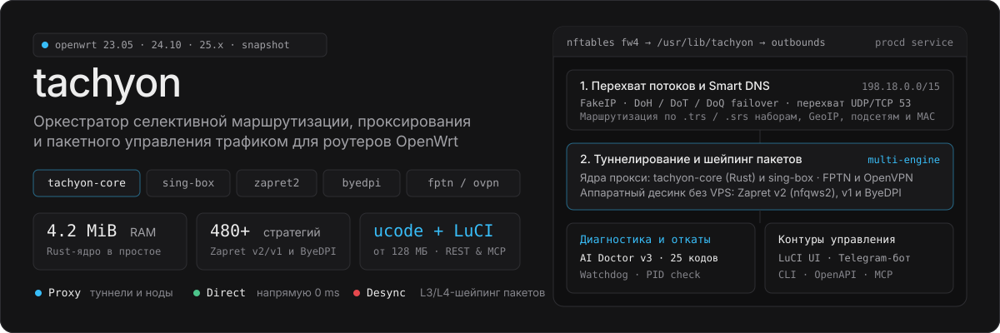
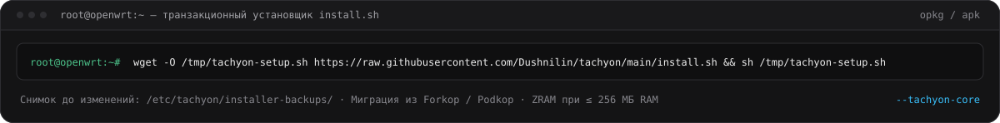
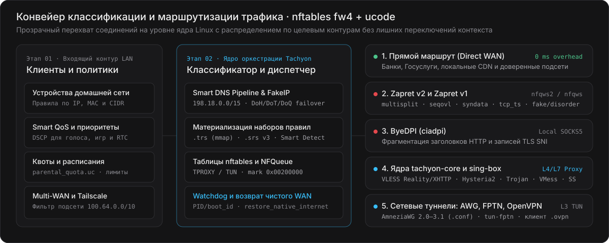
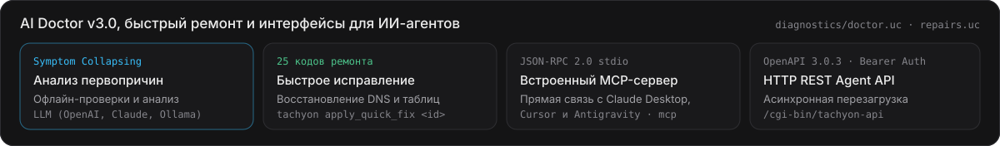
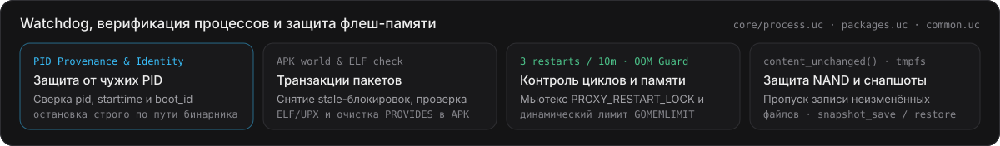
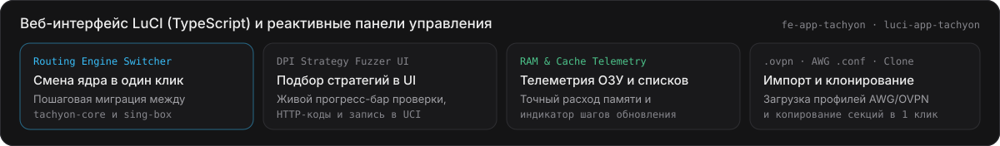
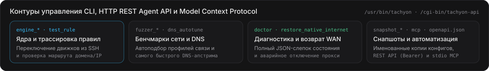

<p align="center">
  
</p>

<p align="center">
  <a href="https://github.com/Dushnilin/tachyon/releases"></a>
  <a href="https://openwrt.org/"></a>
  <a href="https://github.com/Dushnilin/tachyon-core"></a>
  <a href="https://github.com/Dushnilin/tachyon-lists"></a>
  <a href="https://t.me/tachyon_proxy"></a>
  <a href="./LICENSE"></a>
</p>

<p align="center">
  <sub><b>Русский</b> · <a href="README.en.md">English</a> · <a href="https://github.com/Dushnilin/tachyon-core">tachyon-core</a> · <a href="https://github.com/Dushnilin/tachyon-lists">tachyon-lists</a> · <a href="https://boosty.to/tachyon">Boosty</a></sub>
</p>

---

**Tachyon** — пакет оркестрации сетевого трафика, селективной маршрутизации и защищённого туннелирования для роутеров под управлением **OpenWrt** (`23.05`, `24.10`, `25.x` и `SNAPSHOT`). Проект развивает архитектуру **[Forkop (@ushan0v)](https://github.com/ushan0v/forkop)** и оригинального **[Podkop (@itdoginfo)](https://github.com/itdoginfo/podkop)**.

Система объединяет в едином контуре управления мульти-движковую маршрутизацию (**[tachyon-core](https://github.com/Dushnilin/tachyon-core)** на Rust и **sing-box**), туннели **AmneziaWG / WireGuard**, **OpenVPN (`.ovpn`)** и **FPTN**, локальную сегментацию пакетов L3/L4 (**Zapret v2 / Zapret v1 / ByeDPI**) с комбинаторным фаззером параметров соединения, а также подсистему самодиагностики **AI Doctor v3.0**, **Telegram-бота**, **HTTP REST Agent API (OpenAPI 3.0)** и **MCP-сервер**. Вся серверная логика написана на **ucode** — штатном C-интерпретаторе OpenWrt, что позволяет работать на устройствах от 128 МБ ОЗУ без внешних рантаймов.

---

<p align="center">
  
</p>

<p align="center">
  
</p>

Установка выполняется одной командой в SSH-сессии роутера через транзакционный скрипт `install.sh`:

```bash
wget -O /tmp/tachyon-setup.sh https://raw.githubusercontent.com/Dushnilin/tachyon/main/install.sh && sh /tmp/tachyon-setup.sh
```

Для автоматической установки сразу с нативным Rust-ядром `tachyon-core` без интерактивных вопросов:

```bash
sh /tmp/tachyon-setup.sh -y --tachyon-core
```

| Параметр или механизм | Назначение и поведение |
|:---|:---|
| `--tachyon-core` | Установка нативного прокси-ядра `tachyon-core` (Rust, ~4.2 MiB RAM в простое) вместо Go-сборки `sing-box` |
| Интерактивный выбор | При запуске без флагов скрипт предлагает выбрать целевой движок (`tachyon-core`, `sing-box` `stable`/`extended`/`tiny`/`lx`) и версию релиза |
| Транзакционные снимки | До внесения изменений сохраняется резервная копия в `/etc/tachyon/installer-backups/` и состояние `apk-world`; при сбое связи изменения автоматически откатываются |
| Защита памяти (`zram-swap`) | На роутерах с объёмом ОЗУ ≤ 256 МБ установщик проверяет конфигурацию памяти и предлагает активировать `zram-swap` |
| Миграция конфигурации | Автоматический перенос существующих правил и секций из пакетов `forkop`, `podkop-plus` и `podkop` в `/etc/config/tachyon` |
| `--repair` / `--reinstall` | Восстановление сетевых таблиц, хуков файрвола и переустановка пакетов поверх текущей конфигурации |
| `--channel beta` / `--tag X.Y.Z` | Переключение на канал предварительных сборок или установка фиксированной версии релиза |

<details>
<summary><b>Резервные зеркала установки (при ограничении доступа к raw.githubusercontent.com)</b></summary>

<br>

```bash
# Зеркало 1 (jsdelivr.net CDN):
wget -O /tmp/tachyon-setup.sh https://cdn.jsdelivr.net/gh/Dushnilin/tachyon@main/install.sh && sh /tmp/tachyon-setup.sh

# Зеркало 2 (gh-proxy.com):
wget -O /tmp/tachyon-setup.sh https://gh-proxy.com/raw.githubusercontent.com/Dushnilin/tachyon/main/install.sh && sh /tmp/tachyon-setup.sh

# Зеркало 3 (ghfast.top):
wget -O /tmp/tachyon-setup.sh https://ghfast.top/https://raw.githubusercontent.com/Dushnilin/tachyon/main/install.sh && sh /tmp/tachyon-setup.sh
```

</details>

---

<p align="center">
  
</p>

<p align="center">
  
</p>

Tachyon классифицирует трафик через таблицы ядра **nftables** (`fw4`) и направляет соединения в соответствующий контур без лишнего транзита через пользовательское пространство:

| Контур обработки | Механизм в ядре и демоне | Назначение |
|:---|:---|:---|
| **1. Direct WAN** | Прямая маршрутизация мимо TPROXY/TUN (`0 ms overhead`) | Банковские сервисы, государственные порталы, локальные CDN и доверенные российские подсети |
| **2. Zapret v1 / v2** | Перехват первых пакетов в очередь Netfilter (`nfqws` / `nfqws2`) | Аппаратная десинхронизация TCP/UDP (`multisplit`, `seqovl`, `wsize`, `syndata`, PAWS `tcp_ts`, бинарные `blobs`, `fake`/`disorder`) непосредственно на роутере без VPS |
| **3. ByeDPI (`ciadpi`)** | Локальный SOCKS5-прокси десинхронизации | Фрагментация заголовков HTTP и записей TLS ClientHello / SNI |
| **4. Прокси-ядра** | `tachyon-core` / `sing-box` | Селективное туннелирование по доменам, спискам `.trs`/`.srs`/`.lst`, подсетям и устройствам LAN через VLESS Reality/XHTTP, Hysteria2, Trojan, VMess, Shadowsocks |
| **5. L3-туннели** | Сетевые интерфейсы `tun` / WireGuard (таблица `4249` для FPTN) | Пакетное туннелирование через AmneziaWG (`AWG 2.0/3.0/3.1`), WireGuard, встроенный клиент OpenVPN (`.ovpn`) и `fptn-client-cli` поверх WebSocket/TLS |
| **6. Smart DNS** | FakeIP (`198.18.0.0/15`) + перехват UDP/TCP 53 в nftables | Изолированное разрешение имён по DoH, DoT, DoQ и HTTP/3 с непрерывным мониторингом апстримов (`dns_failover.uc`) и защитой от подмены провайдером |

---

<p align="center">
  
</p>

### 1. Мульти-движковая архитектура маршрутизации

Система поддерживает переключение между независимыми движками маршрутизации через веб-интерфейс LuCI или CLI (`tachyon engine_set <name>`) с автоматической перестройкой таблиц `nftables`, сетевых интерфейсов и конфигурации DNS:

| Движок | Исполняемый стек | Ключевые технические характеристики |
|:---|:---|:---|
| **`tachyon-core`** | Нативный Rust (Zero-C-Crypto, без Go runtime и GC) | Около **4.2 MiB RAM** в простое; 100% совместимость с JSON-конфигурацией и CLI `sing-box`; zero-copy `mmap` для наборов правил `.trs`; встроенный Outbound Desync (TCP/TLS/HTTP split) в сетевом стеке без внешних демонов; асинхронный транспорт XHTTP (`packet-up`, `auto`); контроллер перегрузки Brutal CC для Hysteria2; встроенный L3-туннель FPTN; откат на `fallback.json` при сбое валидации; сборки под `aarch64`, `armv7`, `armv6`, `x86-64` и `MIPS/MIPSEL soft-float` (MT7620/MT7621/MT7628) без риска `SIGILL` |
| **`sing-box`** | Go (`stable`, `tiny`, `extended`, `extended-compressed`, `lx`) | Поддержка версий `1.11–1.14+`; все современные прокси-протоколы, группы `urltest` (включая `mode`, `balancer`, `passive_check` на сборках `lx`/`extended`), FakeIP и встроенный OpenVPN-клиент (с `1.14.0`) |

---

### 2. Протоколы, подписки и правила селективной маршрутизации

* **Импорт конфигураций AmneziaWG `2.0 / 3.0 / 3.1` (`.conf`)**: отдельный именованный список между полями URL и текстовых ссылок в настройках секции. Загрузка, редактирование и удаление доступны на ядрах `tachyon-core` и `sing-box lx`. Исходный профиль сохраняется в UCI-опции `selector_amnezia_configs` (до 64 КиБ с именем, один `Interface` и один `Peer`; поля DNS и командные хуки из файла игнорируются). При переключении на ядро без поддержки AWG сохранённые записи не удаляются, но скрываются из активной генерации.
* **Нативный клиент OpenVPN (`.ovpn`)**: прямая загрузка и валидация `.ovpn`-файлов через интерфейс LuCI для ядер `sing-box >= 1.14.0` и `tachyon-core`.
* **Туннель FPTN (`fptn-client-cli`)**: L3-туннелирование IP-пакетов поверх WebSocket/TLS с маскировкой под стандартный HTTPS-трафик (интерфейс `tun-fptn`, таблица маршрутизации `4249`).
* **Обработка провайдерских подписок**:
  * Дешифрование закрытых подписок формата **Happ (`crypt2`–`crypt5`)**.
  * Эмуляция клиентских заголовков **Dual HWID**.
  * Проверка отпечатков сертификатов узлов (**TLS Certificate SHA-256 Pinning**, параметр `pcs`).
  * Защита кэша рабочих узлов (**Anti-Collapse Shrink Guard**) при пустых или ошибочных ответах сервера подписки.
* **Генератор профилей Cloudflare WARP / AmneziaWG**: встроенная команда `tachyon generate_warp`.
* **Исключения Smart Detect (`smart_detect_exclude_lists`)**: в разделе «Настройки → Сервисы и доступ» ручные домены объединяются с пресетами сервисов для исключения из автообнаружения (режимы Default и Plus). Декодированный кэш хранится в `/etc/tachyon/smart-detect-exclusions/` и обновляется штатным планировщиком через `sing-box rule-set decompile` или `tachyon-core`. Если автоматическое расширение до корневого домена захватывает исключённый поддомен, правило создаётся только для конкретного обнаруженного хоста.

---

### 3. Стек Smart DNS и защита от утечек

* **Пул FakeIP (`198.18.0.0/15`)**: немедленная установка соединений без ожидания ответа от удалённого DNS-резолвера.
* **Шифрованные транспорты**: поддержка DNS over HTTPS (DoH), DNS over TLS (DoT), DNS over QUIC (DoQ) и HTTP/3.
* **Автономный DNS Failover (`dns_failover.uc`)**: фоновая проверка доступности апстримов и автоматическое переключение на резервный резолвер без потери разрешения имён.
* **Перехват DNS в ядре**: прозрачное перенаправление трафика портов `53/udp` и `53/tcp` через `nftables` для блокировки провайдерского DNS-хайджекинга.
* **Детектор утечек DNS ([`docs/DNS_LEAK_CHECK.md`](docs/DNS_LEAK_CHECK.md))**: верификация активных резолверов с фильтрацией служебных адресов; в режиме **Plus** дополнительно тестируются локальный резолвер роутера, открытые запросы на WAN и контрольный DoH/TLS-запрос.
* **Подсистема Hosts (`dns_hosts`)**: статические привязки доменов и загрузка внешних списков блокировки рекламы и трекеров (AdAway, StevenBlack, Antizapret) с автоматическим переключением на зеркала (`jsdelivr`, `gh-proxy`).
* **Тестирование и автонастройка DNS**: замер задержек резолверов (`tachyon dns_benchmark`) и автоматический выбор оптимального апстрима (`tachyon dns_autotune --apply`).

---

### 4. Фаззер и генератор профилей сегментации трафика (Packet Fuzzer v2)

* **Модульная структура (`fuzzer/*`)**: раздельные компоненты профилирования сети, запуска проб, оценки стабильности и генерации аргументов.
* **Двухэтапная верификация (Probe v2 & Stable Scoring)**: отсеивание ложноположительных стратегий на соединениях с потерями пакетов.
* **База из 480+ стратегий**: **286+** пресетов для `Zapret v2 (nfqws2)`, **130** для `Zapret v1 (nfqws)` и **65** для `ByeDPI (ciadpi)`, включая проверенные конфигурации из `zapret4rocket`, `homeproxy-hiddify` и паттерны `Flowseal`.
* **Современные техники десинхронизации**:
  * Подмена временных меток TCP (**PAWS TCP Timestamp Spoofing**, `tcp_ts=-600000:tcp_ts_up` по RFC 7323).
  * Точное перекрытие последовательностей (**SeqOvl Pattern Overlap**) и передача данных в пакетах синхронизации (**TCP SYN Data**, `syndata`).
  * Аутентичные бинарные слепки протоколов (**Blobs**): `tls_max`, `tls_google`, `tls_gosuslugi`, `tls_sber`, `quic_google`, `discord_udp`.
* **Изолированное тестирование**: проверка стратегий выполняется в отдельной очереди Netfilter (`mark 0x00200000`) одновременно по списку пользовательских доменов без остановки основного трафика роутера.

---

### 5. Самодиагностика AI Doctor v3.0, REST Agent API и MCP Server

<p align="center">
  
</p>

* **Модульный анализатор (`diagnostics/doctor.uc`, `repairs.uc`, `system_info.uc`, `routing.uc`, `dns.uc`)**:
  * Работает полностью автономно в локальном режиме (`tachyon doctor`) или с привлечением языковых моделей (**OpenAI**, **Claude**, **DeepSeek**, **Gemini**, **OpenRouter**, **Ollama**) через `tachyon ai_doctor`.
  * **Схлопывание симптомов (Symptom Collapsing)**: группирует каскадные сетевые ошибки и выделяет первопричину сбоя.
* **Конфликт-устойчивый откат**: автоматический возврат к последней рабочей конфигурации при обнаружении синтаксических ошибок в правилах `dnsmasq` или `nftables`.
* **Аварийное восстановление интернета**: команда `tachyon restore_native_internet` мгновенно отключает перехват трафика и возвращает прямой выход в WAN.
* **Model Context Protocol (`tachyon mcp`)**: стандартный сервер JSON-RPC 2.0 поверх `stdio` для подключения роутера к Claude Desktop, Cursor и Antigravity.
* **HTTP REST Agent API (`/cgi-bin/tachyon-api`)**: спецификация OpenAPI 3.0.3, авторизация по Bearer-токену с разделением прав чтения/записи и асинхронная перезагрузка служб без разрыва HTTP-соединения.

<details>
<summary><b>Полный перечень 25 кодов быстрого ремонта в <code>diagnostics/repairs.uc</code> (<code>tachyon apply_quick_fix &lt;code&gt;</code>)</b></summary>

<br>

| Категория | Коды автоматического восстановления |
|:---|:---|
| **Службы и память (7)** | `start_singbox`, `restart_singbox_dns`, `start_watchdog`, `restart_providers`, `restart_zapret`, `optimize_memory`, `upgrade_to_singbox_extended` |
| **Сеть и DNS (13)** | `rebuild_rules`, `fix_dnsmasq`, `fix_resolv_symlink`, `clear_dns_cache`, `fix_wan_interface`, `fix_gateway`, `reset_firewall`, `restart_network`, `switch_to_doh`, `fix_bootstrap_dns`, `heal_network_stack`, `enable_safe_bypass`, `restore_native_internet` |
| **Конфигурация и система (5)** | `fix_uci_config`, `update_subscriptions`, `fix_system_time`, `flush_conntrack`, `optimize_mtu` |

</details>

---

### 6. Интерактивный Telegram-бот управления

<p align="center">
  
</p>

* **Интеграция с Clash API**: защищённое подключение по Secret Token, просмотр телеметрии (`/info`) и переключение активных нод и секций маршрутизации из чата.
* **Контроль активных соединений**: постраничный просмотр открытых сессий (`/connections`) и принудительный сброс соединений (`/close_connections`).
* **Изолированный процесс-воркер**: контроль heartbeat с grace-периодом, защита от зомби-процессов и блокировка дублирующихся экземпляров.
* **Управление локальной сетью**: настройка тихих часов (`/qh`) и управление доступом устройств LAN по MAC-адресам.
* **Поддерживаемые команды**: `/doctor`, `/ai_doctor`, `/heal`, `/speed`, `/ping`, `/test`, `/logs`, `/info`, `/export_config`, `/restart`, `/lang`.

---

### 7. Watchdog, контроль процессов и защита флеш-памяти

<p align="center">
  
</p>

* **Верификация происхождения процессов (`core/process.uc`)**: перед отправкой сигналов модуль сверяет `pid`, `starttime` и `boot_id`, исключая завершение чужих системных процессов при переиспользовании PID ядром. Этот же модуль формирует контракт службы `procd` и скрипт `/etc/init.d/tachyon-core`, останавливая демон строго по пути исполняемого файла без вызова `killall` по имени процесса.
* **Транзакционный менеджер пакетов (`core/packages.uc`)**: очистка зависших lock-файлов, проверка заголовков ELF у сжатых через UPX бинарников и автоматическая правка `/etc/apk/world` для устранения конфликтов `PROVIDES/REPLACES` при обновлении пакетов.
* **Защита NAND-памяти от износа (`core/common.uc`)**: все операции записи конфигурации и правил (`write_file`, `write_json_file`, `copy_file`) предварительно сверяют содержимое через `content_unchanged()` и пропускают перезапись идентичных данных на флеш-накопитель; оперативное состояние хранится в `tmpfs` (`/tmp`, `/var/run`).
* **Предотвращение циклов перезапуска**: ограничение до 3 перезапусков за 10 минут под защитой мьютекса `PROXY_RESTART_LOCK`, динамическое управление `GOMEMLIMIT` для Go-процессов и поддержка именованных снимков конфигурации (`snapshot_save` / `snapshot_restore`).

---

### 8. Родительский контроль, квоты трафика и Smart QoS

* **Расписания доступа**: индивидуальные правила разрешения и блокировки интернета для устройств локальной сети по часам и дням недели.
* **Квотирование объёма трафика (`parental_quota.uc`)**: суточные и месячные лимиты входящего/исходящего трафика на устройство с автоматическим сбросом счётчиков по `cron`.
* **Демон приоритизации Smart QoS**: DSCP-маркировка чувствительного к задержкам трафика (голосовые вызовы, игровые пакеты, видеопотоки) в таблицах `nftables` для снижения эффекта Bufferbloat.

---

### 9. Веб-интерфейс LuCI (TypeScript)

<p align="center">
  
</p>

* **Телеметрия памяти на дашборде**: отображение фактического потребления ОЗУ процессами Tachyon и расчётного объёма DNS-кэша `dnsmasq`.
* **Пошаговый индикатор обновлений**: визуализация этапов загрузки и компиляции списков вместо неструктурированного текстового лога.
* **Клонирование секций в один клик (`Copy`)**: быстрое создание копий сложных правил маршрутизации.
* **Встроенные модальные инструменты**: панель переключения движков маршрутизации, интерактивное окно фаззера стратегий с кодами HTTP-ответов и потоковый терминал установки/отката версий компонентов.

---

<p align="center">
  
</p>

<p align="center">
  
</p>

```bash
# Управление движками маршрутизации (Multi-Engine)
tachyon engine_list                             # Список доступных движков (tachyon-core, sing-box)
tachyon engine_get                              # Текущий активный движок
tachyon engine_set <tachyon-core|sing-box>      # Переключение движка с автоматической реконфигурацией
tachyon engine_status                           # Статус активного движка в формате JSON

# Фаззер и подбор профилей сегментации трафика
tachyon fuzzer_start youtube_suite zapret2      # Запуск тестирования профилей для YouTube на Zapret2
tachyon fuzzer_start discord_suite zapret2      # Запуск тестирования для Discord (голос + UDP)
tachyon fuzzer_status                           # Прогресс и результаты фаззера (JSON)
tachyon fuzzer_stop                             # Остановка фаззера и очистка тестовой очереди Netfilter
tachyon fuzzer_apply <strategy_id>              # Применение выбранной стратегии в UCI

# Тестирование DNS и трассировка маршрутов
tachyon dns_benchmark                           # Замер задержки и доступности DNS-резолверов
tachyon dns_autotune --apply                    # Автоматический выбор и применение самого быстрого DNS
tachyon test_rule google.com                    # Проверка правила маршрутизации для домена или IP

# Локальная и ИИ-диагностика
tachyon doctor                                  # Полная локальная диагностика без обращения к LLM
tachyon ai_doctor                               # Анализ состояния с участием LLM
tachyon ai_doctor_last                          # Вывод последнего сохранённого отчёта диагностики
tachyon apply_quick_fix clear_dns_cache         # Выполнение кода быстрого ремонта из diagnostics/repairs.uc
tachyon diagnose_json                           # Полный диагностический слепок системы (JSON)
tachyon restore_native_internet                 # Аварийная остановка перехвата и возврат прямого WAN

# Управление Telegram-ботом и Watchdog
tachyon telegram_status                         # Статус процесса Telegram-бота
tachyon telegram_diagnose                       # Диагностика соединения с API Telegram (JSON)
tachyon telegram_start                          # Запуск воркера Telegram-бота
tachyon telegram_stop                           # Остановка воркера Telegram-бота
tachyon ai_heal                                 # Принудительный запуск цикла самовосстановления Watchdog
tachyon ai_status                               # Краткий статус Watchdog
tachyon ai_status_full                          # Полные метрики Watchdog (JSON)

# Снимки конфигурации, списки и генераторы
tachyon snapshot_list                           # Список сохранённых снимков конфигурации
tachyon snapshot_save my_working_setup          # Создание именованного снимка
tachyon snapshot_restore /etc/config/snap.json  # Восстановление конфигурации из файла снимка
tachyon backup                                  # Создание полного архива конфигурации
tachyon list_update                             # Обновление и компиляция списков доменов и подсетей
tachyon subscription_update                     # Обновление провайдерских подписок
tachyon hosts_list_update                       # Обновление внешних списков блокировки Hosts
tachyon generate_warp                           # Генерация профиля Cloudflare WARP / AmneziaWG
tachyon generate_reality_keypair                # Генерация ключевой пары X25519 для VLESS Reality

# Интерфейсы для ИИ-агентов (MCP и HTTP REST API)
tachyon mcp                                     # Запуск сервера Model Context Protocol (JSON-RPC 2.0 stdio)
curl http://192.168.1.1/cgi-bin/tachyon-api/health
curl http://192.168.1.1/cgi-bin/tachyon-api/openapi.json
```

### Чистое удаление (`uninstall.sh`)

Скрипт удаления останавливает службы, очищает таблицы `nftables`, восстанавливает штатную конфигурацию DNS и сохраняет резервную копию настроек в `/etc/config/tachyon.backup-<timestamp>`:

```bash
wget -O /tmp/tachyon-uninstall.sh https://raw.githubusercontent.com/Dushnilin/tachyon/main/uninstall.sh && sh /tmp/tachyon-uninstall.sh
```

| Флаг | Действие |
|:---|:---|
| `-y`, `--yes` | Неинтерактивное удаление без запроса подтверждения |
| `-p`, `--purge` | Полное удаление пакета вместе с конфигурационными файлами и резервными копиями |
| `--keep-binaries` | Сохранить установленные бинарные файлы (`tachyon-core`, `sing-box`, `zapret`, `byedpi`) в системе |

<details>
<summary><b>Команды удаления через резервные зеркала</b></summary>

<br>

```bash
# Зеркало 1 (jsdelivr.net CDN):
wget -O /tmp/tachyon-uninstall.sh https://cdn.jsdelivr.net/gh/Dushnilin/tachyon@main/uninstall.sh && sh /tmp/tachyon-uninstall.sh

# Зеркало 2 (gh-proxy.com):
wget -O /tmp/tachyon-uninstall.sh https://gh-proxy.com/raw.githubusercontent.com/Dushnilin/tachyon/main/uninstall.sh && sh /tmp/tachyon-uninstall.sh
```

</details>

---

## Связанные проекты и благодарности

* **[Forkop (@ushan0v)](https://github.com/ushan0v/forkop)** — родительский проект (ранее Podkop Plus).
* **[Podkop (@itdoginfo)](https://github.com/itdoginfo/podkop)** — оригинальный проект, заложивший базовую архитектуру маршрутизации.
* **[tachyon-core](https://github.com/Dushnilin/tachyon-core)** — нативное прокси-ядро на чистом Rust (~4.2 MiB RAM в простое, без рантайма Go и C-зависимостей).
* **[tachyon-lists](https://github.com/Dushnilin/tachyon-lists)** — автоматический компилятор и дедупликатор 143 категорий доменов и подсетей в форматах `.trs`, `.srs`, `.json` и `.lst`.
* **[sing-box (SagerNet)](https://github.com/SagerNet/sing-box)** — универсальная прокси-платформа.
* **[zapret / zapret2 (@bol-van)](https://github.com/bol-van/zapret2)** — пакетные анализаторы и десинхронизаторы DPI (`nfqws` / `nfqws2`).
* **[ByeDPI (@hrbrmstr)](https://github.com/hrbrmstr/byedpi)** — локальный SOCKS-прокси десинхронизации (`ciadpi`).
* **[FPTN (@fptn-project)](https://github.com/fptn-project/fptn)** — клиент L3-туннелирования поверх WebSocket/TLS.

---

## Поддержать разработку

Если Tachyon помогает в работе, вы можете поддержать развитие проекта:

* **Boosty:** [boosty.to/tachyon](https://boosty.to/tachyon)
* **Карты РФ и СБП (CloudTips):** [pay.cloudtips.ru/p/449c5ef9](https://pay.cloudtips.ru/p/449c5ef9)
* **Bitcoin (BTC):** `bc1q9ehdv7y9g948jejyflkq7xmau3tytgunxgh35h`
* **Ethereum (ETH / ERC-20):** `0x6CB7a4547eD62EF64990D5C6B5D9fdA58EB223E6`
* **TON:** `UQDPhLRjMz5KltDLACAT3YXXHDVEtIDOHky2i33ZIOtsMEoR`
* **Solana (SOL):** `3csTGaNeU9KjhCKHEKAU3XLS5UfVjEeBVhXihpsETZwh`

---

## Правовая информация и отказ от ответственности

**Отказ от ответственности:**

1. **Назначение программного обеспечения.** `Tachyon` является универсальным техническим средством маршрутизации сетевого трафика, балансировки нагрузки, диагностики сетевых соединений, обеспечения информационной безопасности и построения защищённых корпоративных и личных каналов связи (VPN) для маршрутизаторов OpenWrt.
2. **Соблюдение законодательства.** Программное обеспечение не создавалось, не предназначено и не распространяется для целей нарушения законодательства Российской Федерации (включая ФЗ № 149-ФЗ «Об информации, информационных технологиях и о защите информации») или законодательства любой иной юрисдикции, а равно для неправомерного получения доступа к информационным ресурсам, доступ к которым ограничен в соответствии с законом.
3. **Использование на собственный страх и риск.** Автор и правообладатель не предоставляют никаких прокси/VPN-серверов, узлов связи, подписок, ключей доступа или готовых списков маршрутизации. Программное обеспечение поставляется по принципу «КАК ЕСТЬ» (`AS IS`). Любая установка, настройка и эксплуатация программы осуществляются пользователем исключительно по собственной инициативе, на свой страх и риск и под свою полную единоличную ответственность. Правообладатель не несёт ответственности за действия пользователя, выбранные им конфигурации и любые последствия использования программного обеспечения.
