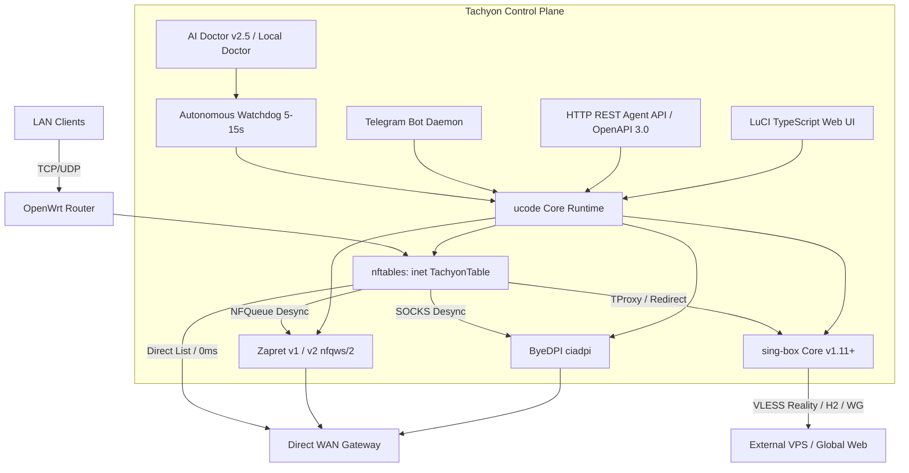

# 01. System Architecture & Core Concepts

## 1. High-Level Overview

**Tachyon** is an enterprise-grade, lightweight traffic orchestration, multi-protocol proxying, and DPI anti-censorship platform built natively for **OpenWrt** (supporting 23.05, 24.10, 25.x, and SNAPSHOT).



---

## 2. Core Architectural Pillars

### 2.1. Native ucode Runtime (Zero Heavy Runtimes)
* All control plane logic, UCI manipulation, config generation, health checks, and JSON APIs are written in **ucode**, OpenWrt's native C-like scripting language.
* **Benefits**:
  * Consumes $\approx$ 1–3 MB RAM (contrasted with 30–60 MB for Python/Node).
  * Executes directly in C-speed with native bindings to `libuci`, `libubus`, `libblobmsg`, and posix syscalls (`fs`, `math`, `socket`).
  * Runs on routers with as little as 128 MB RAM.

### 2.2. Deterministic State & Atomic Writes
* All configuration changes (`/etc/config/tachyon`) and JSON runtime configurations (`/tmp/tachyon/sing-box.json`) use an **atomic write pattern** (`tmp_file + rename`):
  ```ucode
  fs.writefile(tmp_path, json_str);
  fs.rename(tmp_path, target_path);
  ```
  This prevents file corruption during sudden power losses or kernel panics.

### 2.3. Dual Control Interfaces: LuCI & Headless Telegram/REST
1. **LuCI Web UI**: Modern TypeScript SPA (`fe-app-tachyon`) compiled into LuCI JS assets (`luci-app-tachyon`).
2. **Interactive Telegram Bot**: Embedded polling daemon with inline keyboards for on-the-fly server switching, rule updates, and instant diagnostics.
3. **HTTP REST Agent API**: Secure CGI endpoint (`/cgi-bin/tachyon-agent/`) with OpenAPI 3.0.3 spec for integration with LLM agents (ChatGPT Custom GPTs, Cursor, Claude Code, N8N).

---

## 3. Directory Layout & Repository Anatomy

```
tachyon/
├── tachyon/files/                     # Core backend package root
│   ├── etc/
│   │   ├── config/tachyon             # Main UCI configuration (chmod 600)
│   │   ├── init.d/tachyon             # Procd service init script
│   │   └── uci-defaults/              # Post-installation default configs
│   ├── usr/
│   │   ├── bin/tachyon                # Main CLI entrypoint wrapper
│   │   └── lib/tachyon/               # Modular ucode libraries (60+ modules)
│   │       ├── core/                  # Low-level helpers, UCI, constants
│   │       ├── service/               # Lifecycle, Watchdog, APIs, Telegram
│   │       ├── diagnostics/           # AI Doctor, Local Doctor, Quick Fixes
│   │       ├── singbox/               # Config generator, DNS, routing
│   │       ├── providers/             # Zapret v1/v2, ByeDPI, NFQueue
│   │       ├── nft/                   # nftables ruleset compiler & applier
│   │       ├── dns/                   # dnsmasq & DNS routing coordinator
│   │       ├── components/            # Updater, package manager, hosts
│   │       ├── config/                # Validator, rule engine, migrations
│   │       └── subscription/          # Subscriptions fetcher & parser
├── luci-app-tachyon/                  # OpenWrt LuCI package
│   ├── htdocs/luci-static/resources/view/tachyon/ # Compiled frontend JS bundle
│   ├── root/etc/uci-defaults/         # LuCI menu registration
│   └── po/                            # Translations (ru, en)
├── fe-app-tachyon/                    # Frontend TypeScript source
│   ├── src/                           # TypeScript SPA source
│   ├── tsup.config.ts                 # Builds and patches LuCI baseclass
│   └── package.json                   # Dependencies (vitest, typescript, tsup)
├── tests/                             # Comprehensive test suite (100+ shell tests)
├── build.sh                           # Release packager (ipk + apk)
├── install.sh                         # One-liner end-user installer
└── docs/                              # Technical documentation & Knowledge Base
```

---

## 4. Key Runtime Processes & Daemons

| Process | Role | Execution Model |
|---|---|---|
| `sing-box` | Core proxying & packet tunneling engine | Managed by procd (`/etc/init.d/tachyon`) |
| `nfqws` / `nfqws2` | Local TCP/UDP packet desynchronizer (Zapret) | Spawned into background per configured rule |
| `ciadpi` | Local SOCKS desync proxy (ByeDPI) | Spawned on `127.0.0.1:1080` / custom port |
| `watchdog.uc` | State supervision, loop mitigation, self-healing | Background periodic daemon (every 5–15s) |
| `telegram.uc` | Telegram Bot Long-Polling Daemon | Procd-supervised background worker |
| `agent_api.uc` | HTTP REST Agent API Handler | Invoked on-demand via `uhttpd` CGI |
