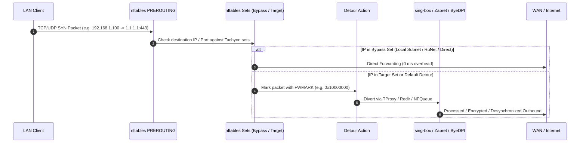

# 03. Networking, nftables & Traffic Routing

## 1. Packet Journey & Routing Lifecycle

Tachyon intercepts traffic at the OpenWrt kernel level using **nftables** and policy routing (`ip rule` + routing table `100`).



---

## 2. nftables Table Structure (`inet TachyonTable`)

Tachyon encapsulates all its firewall rules inside a dedicated table `inet TachyonTable`. This ensures clean isolation from the system `inet fw4` firewall.

### 2.1. Key Chains

1. **`dstnat` / `prerouting` (Hook `prerouting`, priority `-100` / `dstnat`)**:
   * Intercepts incoming LAN client packets before routing decisions.
   * Checks client MAC / IP exclusion lists.
   * Matches destination IP against `tachyon_bypass_v4` / `tachyon_target_v4` sets.
   * Performs TProxy redirect (`tproxy to :10080 meta mark set 0x10000000 accept`) or Port redirect.
2. **`output` (Hook `output`, priority `-100`)**:
   * Intercepts router's own locally generated packets (e.g. DNS lookups, curl, router traffic).
   * Prevents self-interception loops (`meta skuid == "tachyon" return`).
3. **`nfqueue_chain`**:
   * Directs packets destined for Zapret v1 / v2 to kernel NFQueue numbers (`queue num 200`, `queue num 201`).

### 2.2. Bitmask & Firewall Marks

| Mark Value | Meaning | Action |
|---|---|---|
| `0x10000000` | Redirected to sing-box TProxy | Routed to local loopback via table 100 |
| `0x20000000` | Processed by Zapret / NFQueue | Dispatched to nfqws daemon |
| `0x40000000` | Marked for ByeDPI SOCKS | Forwarded to local SOCKS redirect |
| `0x80000000` | Bypass marker (Direct WAN) | Accepted immediately without inspection |

---

## 3. DNS Architecture & Interception

### 3.1. DNS Resolution Pipeline

```
[LAN Client DNS Query: 53]
            │
            ▼
    [dnsmasq / Router]
            │
            ├─► If Domain in Direct / RuNet / Local ──► Local Upstream DNS (ISP / DoH)
            │
            ├─► If Domain in Hosts Section ──────────► Static IP from dns_hosts
            │
            └─► If Domain in Target Proxy / Desync ──► sing-box DNS (127.0.0.1:5353)
                                                               │
                                                               ▼
                                                      [Remote Secure DoH/DoT]
                                                      [Populates nftables set]
```

### 3.2. Dynamic nftables Set Population (`nftset`)
* When dnsmasq resolves a domain associated with a proxy or Zapret rule, it automatically adds the resolved IP address to the corresponding kernel nftables set (e.g. `tachyon_target_v4`).
* This enables sub-millisecond, line-rate packet redirection without re-evaluating domain names in user-space for every packet.

### 3.3. Bootstrap DNS Dead-Lock Prevention
* A critical failure mode in proxy routers is a **DNS loop**: sing-box needs to resolve the VPS hostname (e.g. `vps.example.com`), but its own DNS resolver routes queries through sing-box, which is not yet connected.
* **Tachyon's Solution**:
  * Dedicated `direct_resolvers` (Cloudflare `1.1.1.1`, Google `8.8.8.8`) bypass all proxy rules.
  * Local Rule Doctor monitors bootstrap DNS reachability and automatically executes `fix_bootstrap_dns` if a circular dependency is detected.

---

## 4. Policy Routing (`ip rule` & Routing Tables)

Tachyon provisions routing table `100`:
```sh
# Routing rule for marked packets
ip rule add fwmark 0x10000000/0x10000000 lookup 100 priority 10000

# Local loopback route in table 100
ip route add local default dev lo table 100
```

### 4.1. Emergency Internet Restoration Mechanism
When `tachyon restore_native_internet` is triggered:
1. `inet TachyonTable` is atomically deleted: `nft delete table inet TachyonTable`.
2. Policy routing rule `ip rule del lookup 100` is removed.
3. dnsmasq configuration is reverted to native upstream forwarders.
4. sing-box process is stopped cleanly.
5. Result: Full, native WAN connectivity is restored in under 200 ms without rebooting the router.
