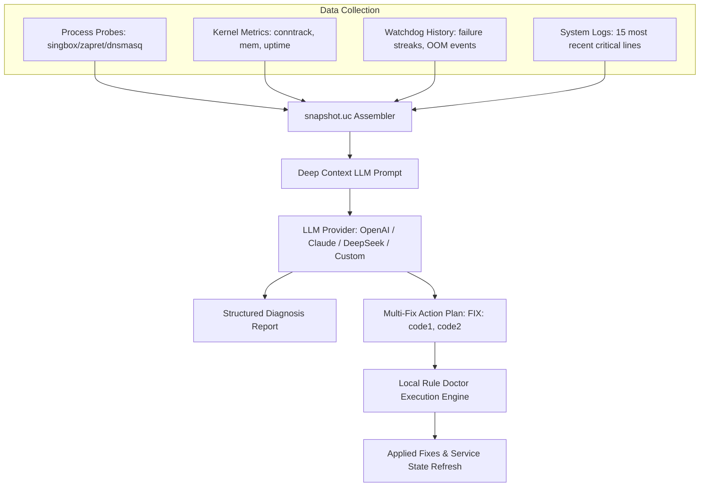

# 05. AI Stack, AI Doctor & Autonomous Self-Healing

## 1. Overview of Tachyon AI Stack

Tachyon provides a dual-layer AI and autonomous resilience stack:
1. **Autonomous Layer (Local Rule Doctor & Watchdog)**: Runs locally on the router every 5–15 seconds, detects network drops, memory leaks, DNS deadlocks, and time desync without requiring internet access or API tokens.
2. **Cognitive Layer (AI Doctor v2.5)**: Deep diagnostics powered by LLMs (OpenAI, Anthropic Claude, DeepSeek, or local Ollama/OpenRouter models) with contextual prompt enrichment and automated Multi-Fix generation.
3. **Agent Integration Layer (HTTP REST Agent API & OpenAPI 3.0)**: Programmatic interface for autonomous AI agents (Cursor, Claude Code, AutoGPT, ChatGPT Custom GPTs, N8N, Dify).

---

## 2. AI Doctor Architecture (v2.5)



---

## 3. Local Rule Doctor & 13 Quick Fix Codes

The execution engine in `diagnostics/runtime.uc` maps standardized fix codes to automated shell/ucode repair procedures:

| Code | Target Subsystem | Action Performed |
|---|---|---|
| `start_singbox` | sing-box | Restarts failed sing-box process via procd. |
| `rebuild_rules` | nftables | Flushes and recompiles `inet TachyonTable` ruleset. |
| `fix_dnsmasq` | dnsmasq | Restarts dnsmasq and checks `/tmp/etc/dnsmasq.conf.*`. |
| `fix_resolv_symlink` | DNS | Restores broken `/etc/resolv.conf` -> `/tmp/resolv.conf.d/resolv.conf.auto` link. |
| `start_watchdog` | Watchdog | Restarts the background watchdog supervisor process. |
| `restart_singbox_dns` | sing-box DNS | Resets internal sing-box DNS server module and cache. |
| `fix_uci_config` | UCI | Restores `/etc/config/tachyon` from the latest valid atomic backup. |
| `fix_wan_interface` | Networking | Runs `ifup wan` to bounce the primary uplink interface. |
| `fix_gateway` | Networking | Re-establishes default routing gateway via `/etc/init.d/network restart`. |
| `clear_dns_cache` | Cache | Flushes dnsmasq cache, deletes sing-box `cache.db`, and restarts DNS. |
| `update_subscriptions`| Subscriptions | Triggers asynchronous background download and refresh of proxy subscriptions. |
| `reset_firewall` | Firewall | Full restart of OpenWrt firewall (`/etc/init.d/firewall restart`). |
| `restart_network` | Network Stack | Full restart of OpenWrt network daemon (`/etc/init.d/network restart`). |
| `fix_system_time` | System NTP | Resynchronizes router clock via NTP pool servers (`ntpd -q -p ...`). |
| `flush_conntrack` | Kernel | Flushes congested `nf_conntrack` table during connection floods. |
| `fix_bootstrap_dns` | Resolver | Unblocks sing-box primary bootstrap resolvers and breaks circular loops. |
| `optimize_mtu` | Tunnels | Auto-calculates optimal MTU (1280–1420) for WireGuard / AmneziaWG interfaces. |
| `restore_native_internet` | Emergency | One-click full teardown of Tachyon proxying; returns pure native WAN routing. |

---

## 4. HTTP REST Agent API & OpenAPI 3.0.3

Tachyon exposes a standardized REST API hosted under `/cgi-bin/tachyon-agent/` via OpenWrt's native `uhttpd`.

### 4.1. Authentication Model
* **Read-Only Endpoints**: Accessible within LAN without authentication (or secured via firewall).
* **Write Endpoints**: Require Bearer token authentication:
  ```http
  POST /cgi-bin/tachyon-agent/ai-doctor/fix
  Authorization: Bearer <agent_api_token>
  Content-Type: application/json

  {"fix": "clear_dns_cache,start_singbox"}
  ```

### 4.2. OpenAPI 3.0.3 Specification
* The live OpenAPI JSON schema is available at:
  ```
  GET /cgi-bin/tachyon-agent/openapi.json
  ```
* This schema allows instant import into **ChatGPT Custom GPT Actions**, **N8N HTTP Request Nodes**, **Dify**, and **Flowise**.

### 4.3. Full Endpoint Index

| Method | Endpoint | Auth Required | Description |
|---|---|---|---|
| `GET` | `/health` | No | Lightweight JSON health status probe. |
| `GET` | `/snapshot` | No | Full system snapshot (interfaces, memory, proxy status). |
| `GET` | `/diagnose` | No | Local Rule Doctor diagnosis report. |
| `GET` | `/logs` | No | Returns last 100 lines of Tachyon system log. |
| `GET` | `/config` | No | Returns sanitized UCI configuration. |
| `GET` | `/tools` | No | OpenAI Function Calling / MCP tool definitions. |
| `GET` | `/openapi.json` | No | OpenAPI 3.0.3 specification JSON. |
| `POST`| `/heal` | **Bearer** | Triggers manual Watchdog self-healing cycle. |
| `POST`| `/ai-doctor/fix` | **Bearer** | Applies one or more quick-fix codes. |
| `POST`| `/restart` | **Bearer** | Restarts specified service (`singbox`, `watchdog`, `dnsmasq`). |
| `POST`| `/reload` | **Bearer** | Soft-reloads configuration and routing tables. |
| `POST`| `/config/set` | **Bearer** | Updates specific UCI options. |
| `POST`| `/section/toggle` | **Bearer** | Enables or disables a routing rule section. |
| `POST`| `/domain/add` | **Bearer** | Appends domain pattern to target rule list. |
