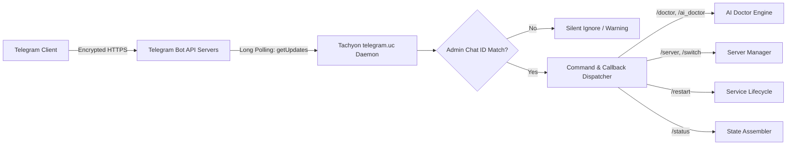

# 09. Telegram Bot Architecture & Management Protocol

Tachyon includes an embedded, high-performance Telegram management bot written entirely in **ucode** (`service/telegram.uc`).

---

## 1. Architectural Highlights



* **No Public IP or Port Forwarding Required**: Uses outbound long-polling (`getUpdates` with 30s timeout) to securely communicate through NAT/firewalls.
* **Zero Overhead Memory Footprint**: Runs as a lightweight ucode process consuming under 2 MB RAM.
* **Role-Based Access Control**: Rejects any commands from chat IDs not explicitly listed in UCI option `telegram_chat_id`.

---

## 2. Command Set Reference

| Command | Arguments | Action |
|---|---|---|
| `/start` | — | Displays main welcome card and interactive control keyboard. |
| `/status` | — | Returns real-time health card: uptime, active server, RAM usage, ping RTT. |
| `/doctor` | — | Executes Local Rule Doctor and returns offline diagnostic report. |
| `/ai_doctor`| — | Invokes AI Doctor with LLM reasoning and returns diagnosis + fix buttons. |
| `/fix` | `<fix_code>` | Applies specific automated repair code (e.g. `/fix clear_dns_cache`). |
| `/server` | — | Opens interactive server selector with inline pagination and RTT pings. |
| `/rules` | — | Shows active routing rules with 1-click toggle switches. |
| `/restart` | `[service]` | Restarts sing-box, dnsmasq, watchdog, or entire network stack. |
| `/backup` | — | Sends latest atomic configuration backup directly to Telegram chat. |

---

## 3. Inline Keyboard & Callback Query Protocol

The bot uses dynamic inline keyboards (`InlineKeyboardMarkup`) for single-tap actions without typing commands.

### 3.1. Callback Data Scheme
Callbacks follow a structured token format: `action:target:param`

```
srv:select:node_1        # Switch active proxy server to node_1
rule:toggle:youtube      # Toggle routing rule 'youtube' on/off
fix:apply:clear_dns_cache# Execute repair code 'clear_dns_cache'
page:srv:2              # Navigate to page 2 of server list
```

### 3.2. Example: Server Switcher Response

```json
{
  "chat_id": 123456789,
  "text": "⚡ <b>Выберите активный сервер:</b>\nТекущий: <i>🇩🇪 Frankfurt VLESS (18 ms)</i>",
  "parse_mode": "HTML",
  "reply_markup": {
    "inline_keyboard": [
      [
        {"text": "🇩🇪 Frankfurt (18 ms) ✅", "callback_data": "srv:select:de_1"},
        {"text": "🇳🇱 Amsterdam (24 ms)", "callback_data": "srv:select:nl_1"}
      ],
      [
        {"text": "🇫🇮 Helsinki (31 ms)", "callback_data": "srv:select:fi_1"},
        {"text": "🇺🇸 New York (95 ms)", "callback_data": "srv:select:us_1"}
      ],
      [
        {"text": "🔄 Замерить пинг", "callback_data": "srv:ping:all"},
        {"text": "🩺 Запустить Доктора", "callback_data": "cmd:doctor"}
      ]
    ]
  }
}
```

---

## 4. Configuration via CLI

```sh
# Set Bot Token
uci set tachyon.settings.enable_telegram='1'
uci set tachyon.settings.telegram_token='123456789:ABCdefGHIjklMNOpqrsTUVwxyz'

# Set Authorized Chat ID(s)
uci set tachyon.settings.telegram_chat_id='123456789'

# Commit and restart service
uci commit tachyon
/etc/init.d/tachyon restart
```
