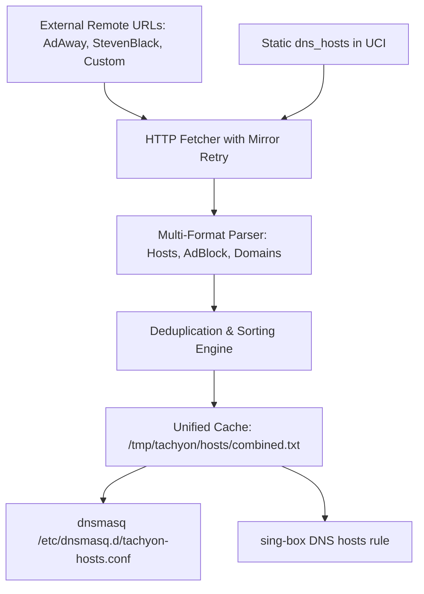

# 10. Hosts Engine, Blocklists & Smart Caching

The Hosts Engine (`components/hosts.uc`) provides automated background ingestion, normalization, deduplication, and caching of external host lists and static DNS overrides.

---

## 1. Architecture of Hosts Engine



---

## 2. Multi-Format Ingestion

The parser automatically detects and normalizes multiple common blocklist formats:

1. **Standard `/etc/hosts` format**:
   ```
   0.0.0.0 ads.example.com
   127.0.0.1 tracker.adserver.net
   ```
2. **Domain-only list format**:
   ```
   malware-domain.org
   telemetry.app.com
   ```
3. **AdBlock / DNSmasq syntax**:
   ```
   ||badsite.com^
   server=/blocked.com/
   address=/ads.org/0.0.0.0
   ```

---

## 3. GitHub Mirror Retry Resiliency

When fetching blocklists hosted on GitHub (e.g. `raw.githubusercontent.com`), access may be blocked or throttled by regional DPI.

Tachyon implements an automated fallback retry chain:
1. **Primary**: Direct HTTPS request to target URL.
2. **Mirror 1**: `https://gh-proxy.com/<original_url>`
3. **Mirror 2**: `https://ghfast.top/<original_url>`
4. **Mirror 3**: `https://ghproxy.net/<original_url>`

If direct connection fails with timeout or SSL handshake error, Tachyon transparently cycles through available mirrors before reporting an error.

---

## 4. Dedicated Hosts Routing (`action = 'hosts'`)

Tachyon supports routing sections that operate purely as DNS-overriding engines without requiring an outbound proxy association.

### Example UCI Configuration:
```ini
config rule 'adblock_section'
    option enabled '1'
    option name 'AdBlock & Anti-Tracker'
    option action 'hosts'
    list hosts_list_urls 'https://raw.githubusercontent.com/StevenBlack/hosts/master/hosts'
    list hosts_list_urls 'https://adaway.org/hosts.txt'
```

* Domains in this section are redirected directly to `0.0.0.0` or custom IPs in dnsmasq / sing-box DNS.
* Zero traffic is routed to external proxies, preserving VPS bandwidth and minimizing latency.
